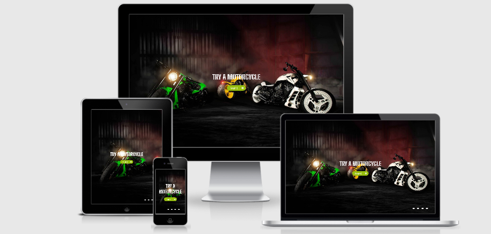
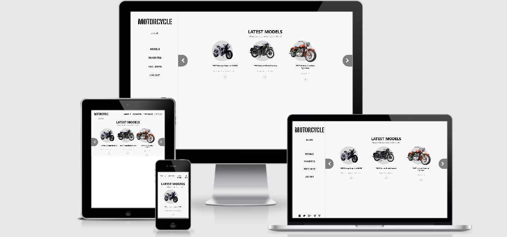

<<<<<<< HEAD
# Motorcycles Store
This is a motorcycles store that show different models of motorcycles to book a test-drive of a motorcycle. This app use The motorcycles-store-api built in rails, this is a responsive web page with a test of every component.

## Built With

- Node.js
- React
- React-DOM
- React-Create-App
- Redux
- npm
- CSS
- ES6.

## Live Demo
[Live Demo Link](https://super-heroess.herokuapp.com)

### Test
- `npm run test`

### Prerequisites

Browser
Internet

## Getting Started

To get a local copy up and running follow these simple example steps:

- Go to https://github.com/Alexoid1/Motocycles-store and clone the repo using:  
`https://github.com/Alexoid1/Motocycles-store.git` in your terminal.

### Github Actions

To make sure the linters' checks using Github Actions work properly, you should follow the next steps:

1. On your recently forked repo, enable the GitHub Actions in the Actions tab.
2. Create the `feature/branch` and push.
3. Start working on your milestone as usual.
4. Open a PR from the `feature/branch` when your work is done.

## Authors

👤 **Pablo Alexis Zambrano Coral**
- Github: [@Alexoid1](https://github.com/Alexoid1)
- Twitter: [@Alexis Zambrano_acz](https://twitter.com/pablo_acz)
- Linkedin: [linkedin](https://www.linkedin.com/in/pablo-alexis-zambrano-coral-7a614a189/)

## 🤝 Contributing

Contributions, issues and feature requests are welcome!

Feel free to check the [issues page](https://github.com/Alexoid1/Motocycles-store/issues).

## Show your support

Give a ⭐️ if you like this project!

## Acknowledgments
- Design idea by [Murat Korkmaz on Behance](https://www.behance.net/muratk),[book a Vespa](https://www.behance.net/gallery/26425031/Vespa-Responsive-Redesign)
- Microverse

## 📝 License

=======

# Motorcycles Store
This is a motorcycles store that show different models of motorcycles to book a test-drive of a motorcycle. This app use The motorcycles-store-api built in rails, this is a responsive web page with a test of every component.

## Built With

- Node.js
- React
- React-DOM
- React-Create-App
- Redux
- npm
- CSS
- ES6.

## Live Demo
[Live Demo Link](https://motorcycles-store.herokuapp.com)

### Test
- `npm run test`

### Prerequisites

Browser
Internet

## Getting Started

To get a local copy up and running follow these simple example steps:

- Go to https://github.com/Alexoid1/Motocycles-store and clone the repo using:  
`https://github.com/Alexoid1/Motocycles-store.git` in your terminal.

### Github Actions

To make sure the linters' checks using Github Actions work properly, you should follow the next steps:

1. On your recently forked repo, enable the GitHub Actions in the Actions tab.
2. Create the `feature/branch` and push.
3. Start working on your milestone as usual.
4. Open a PR from the `feature/branch` when your work is done.

## Authors

👤 **Pablo Alexis Zambrano Coral**
- Github: [@Alexoid1](https://github.com/Alexoid1)
- Twitter: [@Alexis Zambrano_acz](https://twitter.com/pablo_acz)
- Linkedin: [linkedin](https://www.linkedin.com/in/pablo-alexis-zambrano-coral-7a614a189/)

## 🤝 Contributing

Contributions, issues and feature requests are welcome!

Feel free to check the [issues page](https://github.com/Alexoid1/Motocycles-store/issues).

## Show your support

Give a ⭐️ if you like this project!

## Acknowledgments
- Design idea by [Murat Korkmaz on Behance](https://www.behance.net/muratk),[book a Vespa](https://www.behance.net/gallery/26425031/Vespa-Responsive-Redesign)
- Microverse

## 📝 License

>>>>>>> feature-motocyles
This project is [MIT]() licensed.
